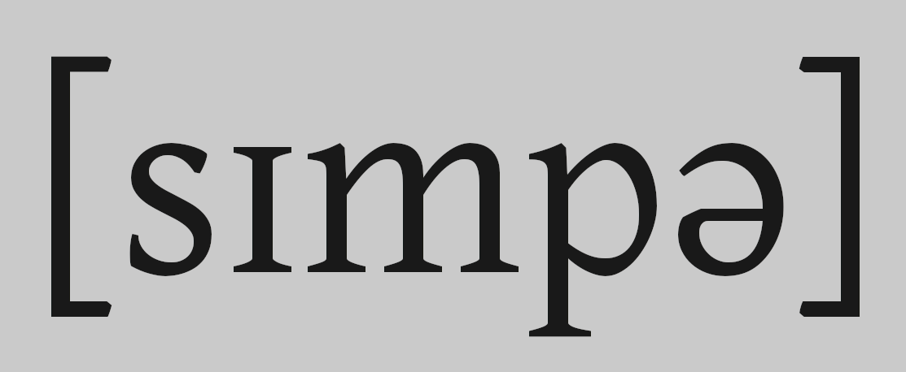

# Simpa: a simple XSAMPA to IPA converter

## What does it do?
Simpa coverts any XSAMPA fed to it through stdin and outputs it to stdout as IPA.

## Is that it?
Yes, that's it. You can do whatever you want with this power. Here's some ideas:
- Replace text in vim by running it through `!simpa`.
\

- Bind a command to [Obsidian](https://obsidian.md/) using [obsidian-shellcommands](https://github.com/Taitava/obsidian-shellcommands).
\

- Set up a keybinding for a shell script that translates the current selection to IPA.
\

The possibilities are endless!

## Flags
`-c use CXS (Conlang X-SAMPA)`